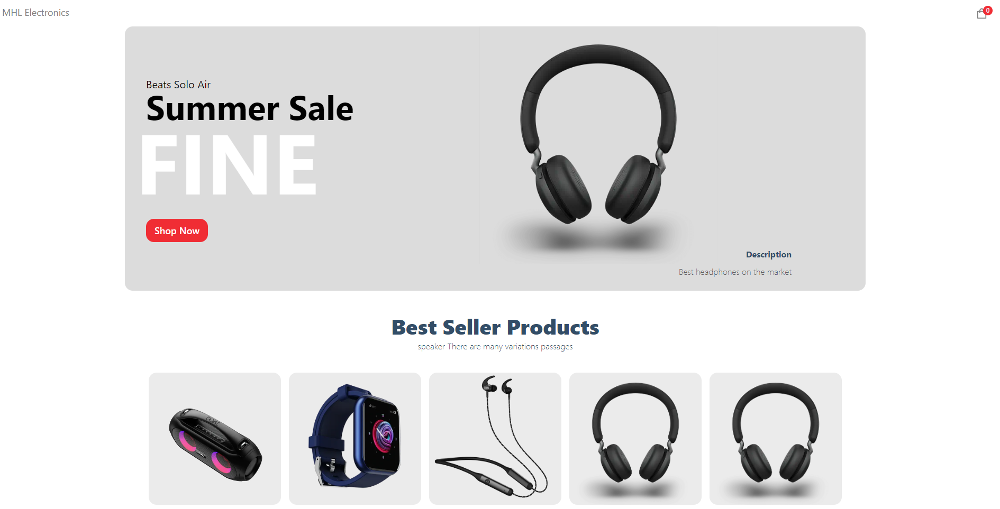
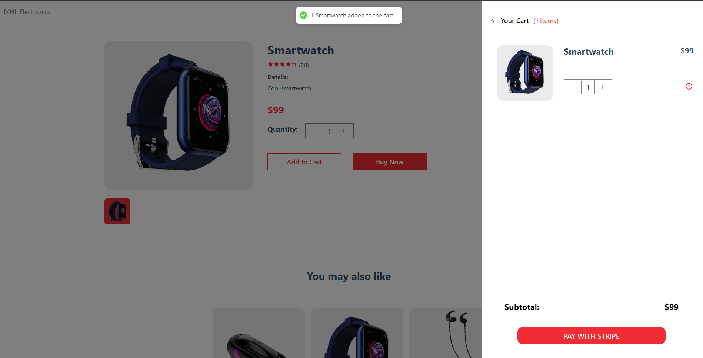
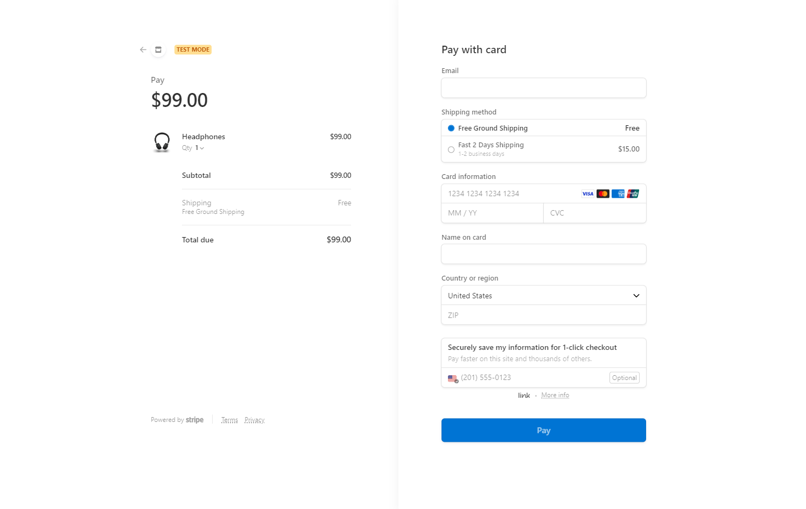

# E-Commerce Website

This is an E-Commerce website built using Next.js, React.js, Sanity.io, and Stripe.

## Features

- Product browsing
- Shopping cart
- Checkout
- Payment processing

## Technologies Used

- [Typescript] (https://www.typescriptlang.org/)
- [Javascript] (https://developer.mozilla.org/en-US/docs/Web/JavaScript)
- [Next.js] (https://nextjs.org/)
- [React.js] (https://reactjs.org/)
- [Sanity.io] (https://www.sanity.io/)
- [Stripe] (https://stripe.com/)
- [HTML] (https://developer.mozilla.org/en-US/docs/Web/HTML)
- [CSS] (https://developer.mozilla.org/en-US/docs/Web/CSS)

## Screenshots





## Installation

Clone the repository and run the following command to install the dependencies:

```
npm install --legacy-peer-deps
```

## Usage

Start the development server with the following command:

### Start your Frontend Server by running:

```
npm run dev
```

### Start your Backend Server by running:

Go to the backend folder (`./sanity_ecommerce/) and run the following command:

```
sanity start
```

The website will be running on http://localhost:3000.

## Contributing

Pull requests are welcome. For major changes, please open an issue first to discuss what you would like to change.

## License

[MIT](https://choosealicense.com/licenses/mit/)
